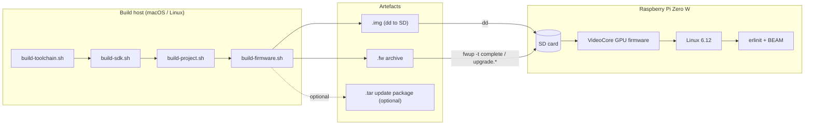
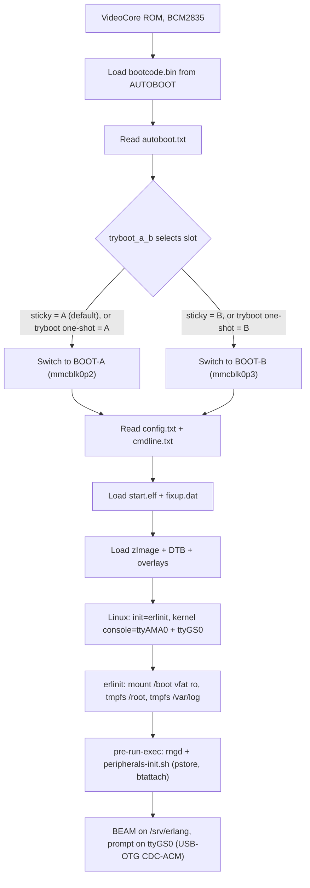
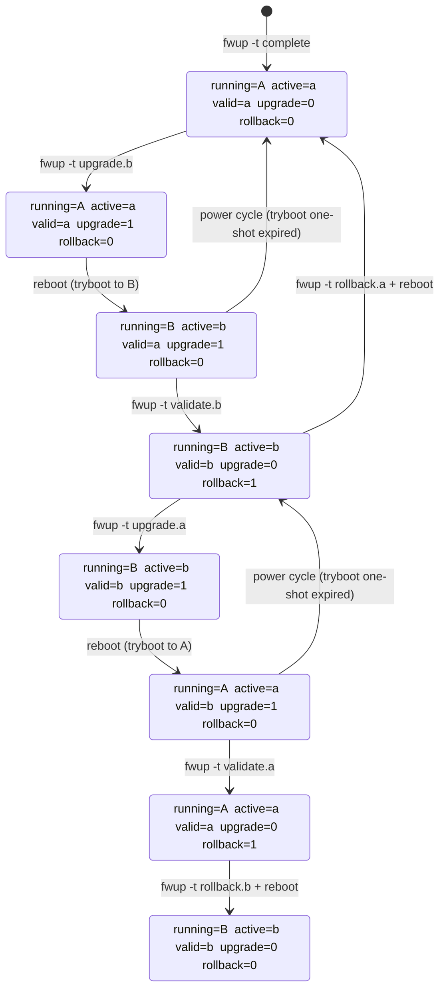
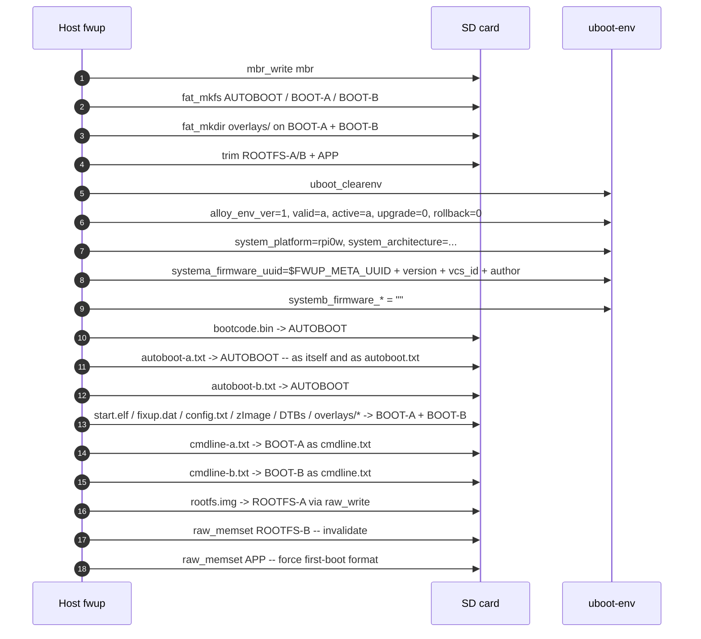
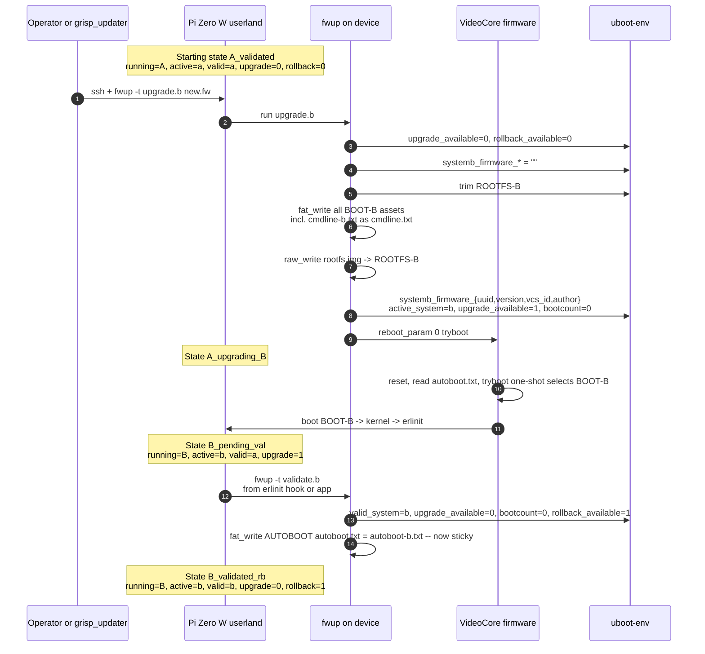
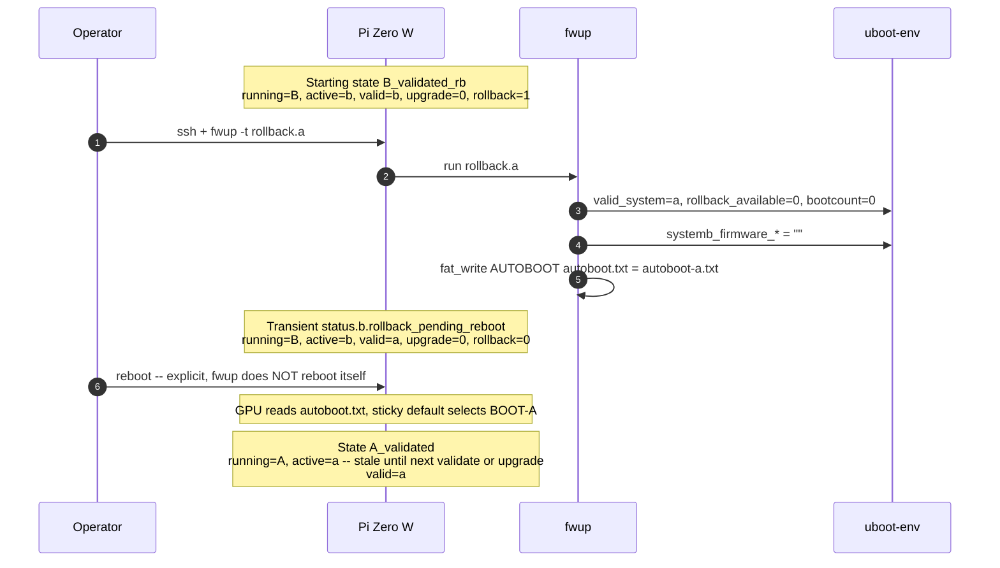
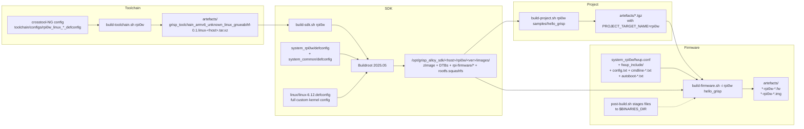

# `system_rpi0w`: Architecture and Design Reference

Design-level documentation for the Raspberry Pi Zero W target. Captures
the key decisions and runtime behaviour: partition layout, boot chain,
`uboot-env` schema, and the A/B update / validate / rollback lifecycle.
For the narrower implementation plan and decision log see
[`../system_rpi0w-plan.md`](../system_rpi0w-plan.md).

- [1. Overview](#1-overview)
- [2. SD card layout](#2-sd-card-layout)
- [3. Boot chain](#3-boot-chain)
- [4. `uboot-env` runtime schema](#4-uboot-env-runtime-schema)
- [5. A/B update lifecycle](#5-ab-update-lifecycle)
  - [5.1 State machine](#51-state-machine)
  - [5.2 Factory flash (`fwup -t complete`)](#52-factory-flash-fwup--t-complete)
  - [5.3 Upgrade + tryboot + validate](#53-upgrade--tryboot--validate)
  - [5.4 Rollback](#54-rollback)
- [6. Build pipeline](#6-build-pipeline)
- [7. File tree](#7-file-tree)
- [8. Status](#8-status)
- [9. References](#9-references)

## 1. Overview

`system_rpi0w` is a **hybrid** target: it uses the RPi Zero W's
bootloader-less boot chain (VideoCore GPU firmware + `tryboot_a_b`),
while adopting `grisp_alloy`'s runtime conventions (same `GRISP_FW_*`
defines, same `uboot-env` KV schema, same `fwup` task vocabulary)
verbatim from `system_kontron-albl-imx8mm/fwup.conf`. The only
rpi0w-specific deviation from the alloy task set is a `fat_write` of
`autoboot.txt` inside `validate.*` / `rollback.*`, the
bootloader-less equivalent of what kontron's U-Boot does at boot
time.



## 2. SD card layout

7-partition MBR. AUTOBOOT is primary 0 with `boot=true` so the BCM2835
ROM looks there first; BOOT-A and BOOT-B are FAT siblings; an extended
container holds three logical partitions for rootfs A/B and APP.

```
block offset         size       role                         Linux path
──────────────────────────────────────────────────────────────────────────
0                    1 block    MBR
16                   8 KiB      uboot-env KV store           (raw, no FS)
2048         (1 MiB) 16 MiB     AUTOBOOT FAT (boot=true)     /dev/mmcblk0p1
34816       (17 MiB) 32 MiB     BOOT-A FAT                   /dev/mmcblk0p2
100352      (49 MiB) 32 MiB     BOOT-B FAT                   /dev/mmcblk0p3
165888      (81 MiB) extended   extended container           /dev/mmcblk0p4
  └─ 167936 (82 MiB) 140 MiB    ROOTFS-A squashfs            /dev/mmcblk0p5
  └─ 456704(223 MiB) 140 MiB    ROOTFS-B squashfs            /dev/mmcblk0p6
  └─ 745472(364 MiB) 512 MiB    APP ext4 (expand = true)     /dev/mmcblk0p7
```

Offsets and sizes are sourced from
[`system_rpi0w/fwup_include/fwup-common.conf`](../system_rpi0w/fwup_include/fwup-common.conf)
as a single source of truth; `fwup.conf` and `etc/fw_env.config`
reference the same macros.

**Contents per partition at factory-flash time (`fwup -t complete`):**

| Partition | Contents                                                                                                                                                            |
| --------- | ------------------------------------------------------------------------------------------------------------------------------------------------------------------- |
| AUTOBOOT  | `bootcode.bin`, `autoboot.txt` (= `autoboot-a.txt`), `autoboot-a.txt`, `autoboot-b.txt`                                                                             |
| BOOT-A    | `start.elf`, `fixup.dat`, `config.txt`, `cmdline.txt` (= `cmdline-a.txt`), `zImage`, `bcm2708-rpi-zero{,-w}.dtb`, `overlays/dwc2.dtbo`, `overlays/miniuart-bt.dtbo`, `overlays/ramoops.dtbo` |
| BOOT-B    | Same files as BOOT-A, except `cmdline.txt` = `cmdline-b.txt`                                                                                                                                  |
| ROOTFS-A  | `rootfs.squashfs`                                                                                                                                                   |
| ROOTFS-B  | zero-filled (invalidated by `raw_memset`)                                                                                                                           |
| APP       | zero-filled (first boot auto-formats ext4)                                                                                                                          |

## 3. Boot chain



**Slot selection is entirely driven by `autoboot.txt`**, the live copy
on the AUTOBOOT partition. Whichever slot was validated last is the
sticky default target; the other slot is the tryboot one-shot target.
That file is rewritten by `fwup -t validate.{a,b}` and
`fwup -t rollback.{a,b}` (see §5).

## 4. `uboot-env` runtime schema

An 8 KiB raw KV store at block 16. **No U-Boot actually reads this at
boot**: it's userland-only state, queried with `fw_printenv` and
mutated by `fwup` tasks. Adopted verbatim from
`system_kontron-albl-imx8mm/fwup.conf:230-272` so `grisp_updater` and
friends treat rpi0w the same as kontron from userland.

| Variable                                        | Type                            | Set by                                                   | Meaning                                                                                                                                                    |
| ----------------------------------------------- | ------------------------------- | -------------------------------------------------------- | ---------------------------------------------------------------------------------------------------------------------------------------------------------- |
| `alloy_env_ver`                                 | `"1"`                           | `complete`                                               | Schema version; all tasks guard on this.                                                                                                                   |
| `valid_system`                                  | `"a"` / `"b"`                   | `complete`, `validate.*`, `rollback.*`                   | The slot known to boot successfully (sticky).                                                                                                              |
| `active_system`                                 | `"a"` / `"b"`                   | `complete`, `upgrade.*` (predictive on-finish)           | The slot the device is running. rpi0w-specific: upgrade._ pre-sets this before tryboot-reboot so `status._.upgraded` tasks match in the validation window. |
| `upgrade_available`                             | `"0"` / `"1"`                   | `upgrade.*`, `validate.*`, `rollback.*`                  | 1 between `upgrade.*` and `validate.*`.                                                                                                                    |
| `upgrade_fallback`                              | `"0"` / `"1"`                   | placeholder (kontron symmetry; rpi0w never sets 1 today) | Reserved for future "revert after N failed boots" logic.                                                                                                   |
| `rollback_available`                            | `"0"` / `"1"`                   | `validate.*` (sets 1), `rollback.*` (sets 0)             | 1 after a successful validation; rollback is one-shot.                                                                                                     |
| `bootcount`                                     | int string                      | `upgrade.*`, `validate.*`, `rollback.*` (all reset to 0) | Placeholder for cross-target schema compat; no bootloader increments it on rpi0w.                                                                          |
| `system_platform`                               | `"rpi0w"`                       | `complete`                                               | Guarded by every task; mismatched `.fw` hits `*.wrongplatform`.                                                                                            |
| `system_architecture`                           | `"arm-unknown-linux-gnueabihf"` | `complete`                                               | Same.                                                                                                                                                      |
| `systema_firmware_{uuid,version,vcs_id,author}` | strings                         | `complete`, `upgrade.a`, `rollback.b`                    | Slot A metadata. UUID is filled from `${FWUP_META_UUID}`.                                                                                                  |
| `systemb_firmware_*`                            | strings                         | `complete` (empty), `upgrade.b`, `rollback.a`            | Slot B metadata.                                                                                                                                           |
| `bootargs_extra`                                | string                          | `complete` (empty)                                       | Hook for RT isolcpus / ramoops region; currently unused (cmdline-a/b.txt is the authoritative kernel cmdline).                                             |

## 5. A/B update lifecycle

### 5.1 State machine

States are tuples of `(running_slot, active_system, valid_system,
upgrade_available, rollback_available)`. Transition labels are the
`fwup` task that causes them (and a reboot, where applicable).



**Mapping to `status.*` tasks** (read-only diagnostics; `fwup -t
status.<name>` errors out if none match):

| State                                               | Matching `status.*` task               |
| --------------------------------------------------- | -------------------------------------- |
| `A_validated`                                       | `status.a.validated_no_rollback`       |
| `A_validated_rb`                                    | `status.a.validated_with_rollback`     |
| `B_validated`                                       | `status.b.validated_no_rollback`       |
| `B_validated_rb`                                    | `status.b.validated_with_rollback`     |
| `A_upgrading_B`                                     | `status.a.upgrading`                   |
| `B_upgrading_A`                                     | `status.b.upgrading`                   |
| `A_pending_val`                                     | `status.a.upgraded`                    |
| `B_pending_val`                                     | `status.b.upgraded`                    |
| _(transient, post-rollback, pre-reboot; see §5.4)_ | `status.{a,b}.rollback_pending_reboot` |

### 5.2 Factory flash (`fwup -t complete`)

Run once per device, typically against `/dev/mmcblk0` with `fwup -a
-i <fw> -t complete -d <device>` or equivalent via Etcher / `dd`
of the matching `.img`.



**Why both BOOT-A _and_ BOOT-B are populated at factory time**: it means
the very first `fwup -t upgrade.b` is a pure rewrite of an already-
formatted FAT, not a format-then-populate. Tryboot-to-B after factory
flash just works.

### 5.3 Upgrade + tryboot + validate

The happy path A → B and back.



**Failure branch**: if the kernel or userland on the new slot crashes
before `validate.b` runs and the board power-cycles:

- `autoboot.txt` still contains `autoboot-a.txt`'s bytes (validate.b
  never wrote it).
- The tryboot one-shot has already been consumed.
- The sticky default (slot A) wins → back on A.
- `env` still says `active_system=b, valid_system=a, upgrade_available=1`,
  which no `status.*` task matches cleanly. `fwup -t rollback.a` or a
  subsequent `fwup -t upgrade.b` resets it.

This is the rpi0w analogue of kontron's "bootcount expired, revert to
`valid_system`": the mechanism differs but the observable outcome is
the same.

### 5.4 Rollback

Explicit operator action. Unlike upgrade, rollback does **not** use
tryboot. It rewrites `autoboot.txt` to point at the other slot as
the sticky default, so the next normal reboot goes there.



**Known quirk**: post-rollback-reboot, `active_system` in `env` still
reports the pre-rollback slot until the next `upgrade.*` or
`validate.*` runs. `fw_printenv active_system` will lie briefly.
Callers that care should reconcile against `/proc/cmdline` or
`findmnt /`. Setting `active_system` inside `rollback.*` would fix
this, but would also lie during the pre-reboot transient window;
neither choice is correct in all moments without a proper boot hook.
Revisit when we wire up a systemd / erlinit "sync active_system on
boot" unit.

## 6. Build pipeline

Four shell scripts in sequence, each consuming the output of the
previous and emitting exactly one artefact kind.



Script responsibilities:

| Script                 | Input                                                                         | Output                                               | rpi0w-specific notes                                                                                                                                       |
| ---------------------- | ----------------------------------------------------------------------------- | ---------------------------------------------------- | ---------------------------------------------------------------------------------------------------------------------------------------------------------- |
| `build-toolchain.sh`   | `toolchain/configs/rpi0w_linux_{x86_64,aarch64}_defconfig`                    | `grisp_toolchain_armv6_*` tar.xz in `artefacts/`     | On non-Linux hosts, self-hoists into Vagrant; no darwin defconfig.                                                                                         |
| `build-sdk.sh`         | `system_rpi0w/defconfig` + `system_common/defconfig` + `linux/linux-6.12.defconfig` | Kernel + DTBs + `rpi-firmware/*` + `rootfs.squashfs` | Sources `crucible.sh` after SDK install for `BOOTSCHEME`, `SQUASHFS_PRIORITIES`, etc.                                                                |
| `build-project.sh`     | Sample or user project                                                        | `.tgz` with release bundle                           | `PROJECT_TARGET_NAME=rpi0w`.                                                                                                                               |
| `build-firmware.sh -i` | `.tgz` + `fwup.conf` + staged boot files                                      | `.fw` + `.img`                                       | `post-build.sh` stages `fwup_include/` + `config.txt` + `cmdline-{a,b}.txt` + `autoboot-{a,b}.txt` into `$BINARIES_DIR` so `fwup.conf` host-paths resolve. |
| `build-firmware.sh -u` | Same                                                                          | `.tar` update package                                | Needs `BOOTSCHEME=RPI` plugin; not wired up yet.                                                                                                           |

## 7. File tree

```
system_rpi0w/
├── VERSION                          "0.1.0"
├── Config.in                        (empty target-specific Buildroot opts)
├── external.desc                    informational "name: RPI0W"
├── external.mk                      placeholder for custom packages
├── crucible.sh                      BOOTSCHEME=NONE, FWUP_IMAGE_TARGETS=(complete), OS_RELEASE_PRETTY_NAME
├── defconfig                        Buildroot overrides (ARMv6, RPi kernel, rpi-firmware, Wi-Fi, ...)
├── README.md                        high-level target notes
├── fwup.conf                        full alloy task set (complete + upgrade.* + validate.* + rollback.* + status.*)
├── post-build.sh                    stage fwup_include/ + config.txt + cmdline-*.txt + autoboot-*.txt into $BINARIES_DIR
├── config.txt                       GPU firmware config (gpu_mem, dtoverlay=dwc2 + miniuart-bt + ramoops, ACT LED)
├── cmdline-a.txt                    root=/dev/mmcblk0p5 rootwait rootfstype=squashfs console=ttyAMA0,115200 console=ttyGS0
├── cmdline-b.txt                    root=/dev/mmcblk0p6 (same)
├── autoboot-a.txt                   sticky=BOOT-A, tryboot=BOOT-B
├── autoboot-b.txt                   sticky=BOOT-B, tryboot=BOOT-A
├── fwup_include/
│   ├── fwup-common.conf             partition offsets/counts + uboot-env block
│   └── provisioning.conf            empty include stub
├── linux/
│   └── linux-6.12.defconfig         full custom kernel defconfig (Kontron idiom; seeded from Nerves' rpi0)
│                                    (no MODULE_COMPRESS; brcmfmac + BT stack + hci_uart_bcm as =m;
│                                     USB gadget chain =y; SQUASHFS_XZ/ZLIB; PSTORE_RAM; SERIAL_DEV_BUS)
└── rootfs_overlay/
    ├── etc/
    │   ├── erlinit.config           -c ttyGS0, --pre-run-exec rngd + peripherals-init.sh,
    │   │                            -m /dev/mmcblk0p2:/boot:vfat:ro..., tmpfs /root + /var/log,
    │   │                            -r /srv/erlang, -n rpi0w-%s
    │   └── fw_env.config            /dev/mmcblk0 0x2000 0x2000 0x200 16
    └── sbin/
        └── peripherals-init.sh      mount pstore; btattach BCM43438 on /dev/ttyAMA1 (non-fatal)

toolchain/configs/
├── rpi0w_linux_x86_64_defconfig     crosstool-NG: ARMv6 / arm1176jzf-s / VFP / GCC 13
└── rpi0w_linux_aarch64_defconfig    same target, aarch64 build host
```

## 8. Status

Legend for the tables below:

- **Working**: driver is compiled, loads at boot, and has been exercised
  end-to-end on real hardware during bring-up.
- **Kernel ready**: driver is compiled and should load, but we haven't
  run the peripheral through a real test on the board. Safe default
  assumption: it would work, but don't treat it as contract.
- **Opt-in**: kernel support present, userspace packages or config
  changes required to actually use it; left off by default because
  it's not in GRiSP's usual deployment profile.
- **Not in scope**: intentionally not configured for this target;
  noted so readers don't wonder why it's missing.

### 8.1 Build + boot

| Area                                                         | State                                                                                                                                                           |
| ------------------------------------------------------------ | --------------------------------------------------------------------------------------------------------------------------------------------------------------- |
| Scaffolding + toolchain config                               | Files shipped                                                                                                                                                   |
| ARMv6 crosstool-NG toolchain                                 | Built + cached                                                                                                                                                  |
| Minimal SDK (Linux kernel + rootfs.squashfs)                 | Built                                                                                                                                                           |
| Firmware image (`.fw` / `.img`) with full alloy task set     | Built + flashed; `hello_grisp` boots to BEAM prompt on `ttyGS0`                                                                                                 |
| A/B update lifecycle (upgrade / validate / rollback)         | Kernel ready: `fwup` task set implemented; tryboot + validate + rollback paths not yet exercised end-to-end on hardware                                         |
| Update package (`BOOTSCHEME=RPI` plugin + `ops.fw` + `.tar`) | Not started                                                                                                                                                     |

### 8.2 On-board peripherals

| Peripheral               | State          | Notes                                                                                                                                                           |
| ------------------------ | -------------- | --------------------------------------------------------------------------------------------------------------------------------------------------------------- |
| USB-OTG CDC-ACM console  | Working        | `g_serial` built-in, `ttyGS0` is the BEAM prompt via `erlinit -c ttyGS0`. `/dev/tty.usbmodem*` on macOS host.                                                   |
| PL011 UART (`ttyAMA0`)   | Working        | Also on `cmdline-*.txt console=`, so kernel messages reach it even when the BEAM drives `ttyGS0`. PL011 kept free of BT via `dtoverlay=miniuart-bt`.            |
| MicroSD / SDHCI          | Working        | Boots from it on every flash; no further validation needed.                                                                                                     |
| Wi-Fi (BCM43430, SDIO)   | Working        | `brcmfmac` + deps modprobed by `peripherals-init.sh`, `wlan0` up with Broadcom MAC, firmware `7.45.98 (TOB)` loaded. AP association not yet validated; `wpa_supplicant` and `iw` are in the rootfs but no config plumbing. |
| Bluetooth (BCM43438)     | Working        | `hci_uart` + `btbcm` + `bluetooth` loaded, `BCM43430A1.hcd` patchram applied via miniuart serdev, `hci0` up. Pairing / LE scan not yet validated; `bluez5_utils` present. |
| Ramoops / pstore         | Working        | `CONFIG_PSTORE_RAM=y`, overlay staged, mounted on `/sys/fs/pstore` by `peripherals-init.sh`. Warm-reboot capture not yet stress-tested across a forced panic.   |
| Hardware RNG             | Kernel ready   | `CONFIG_HW_RANDOM=y`, `/dev/hwrng` present. No `rngd` or equivalent seeding configured.                                                                         |
| Thermal sensor           | Kernel ready   | `CONFIG_BCM2835_THERMAL=y`; `/sys/class/thermal/thermal_zone0/temp` reads.                                                                                      |
| Watchdog                 | Kernel ready   | `CONFIG_BCM2835_WDT=y`, `CONFIG_WATCHDOG_NOWAYOUT=y`; no userspace petting configured.                                                                          |
| ACT LED                  | Working        | `dtparam=act_led_trigger=heartbeat` in `config.txt`.                                                                                                            |

### 8.3 GPIO header (40-pin)

| Feature                   | State          | Notes                                                                                                                                                           |
| ------------------------- | -------------- | --------------------------------------------------------------------------------------------------------------------------------------------------------------- |
| GPIO (chardev, `/dev/gpiochip*`) | Kernel ready   | `gpio-bcm-virt` + `raspberrypi-gpiomem` drivers compiled. `libgpiod` userspace **not** shipped yet.                                                      |
| I2C on GPIO2/3            | Kernel ready   | `dtparam=i2c_arm=on`, `i2c-bcm2835` + `i2c-dev`; `/dev/i2c-1` at boot. `i2c-tools` userspace not shipped.                                                       |
| SPI on GPIO7-11           | Kernel ready   | `dtparam=spi=on`, `spi-bcm2835` + `spidev`; `/dev/spidev0.*` at boot. No userspace test tool shipped.                                                           |
| 1-wire on GPIO            | Kernel ready   | `w1-gpio`, `w1-therm` (DS18B20) as modules.                                                                                                                     |
| PWM                       | Kernel ready   | `pwm-bcm2835` as module.                                                                                                                                        |
| I2S audio                 | Kernel ready   | `snd-bcm2835-i2s` + HifiBerry / GoogleVoiceHat cards as modules; no ALSA userspace shipped.                                                                     |

### 8.4 Camera and display

| Feature                   | State     | Notes                                                                                                                                                           |
| ------------------------- | --------- | --------------------------------------------------------------------------------------------------------------------------------------------------------------- |
| CSI camera (IMX219, OV5647, IMX477, IMX708, IMX296) | Opt-in    | All sensor drivers compiled as modules, `camera_auto_detect=1` in `config.txt`, `UNICAM_LEGACY` + `pisp-be` bridge modules present. Userspace (libcamera / rpicam-apps / v4l-utils / media-ctl) **not** shipped; add `BR2_PACKAGE_LIBCAMERA=y` + `BR2_PACKAGE_V4L_UTILS=y` + `BR2_PACKAGE_MEDIA_CTL=y` to `system_rpi0w/defconfig` if you need it. |
| DSI touchscreen panel     | Opt-in    | `DRM_PANEL_RASPBERRYPI_TOUCHSCREEN` + `TOUCHSCREEN_RASPBERRYPI_FW` compiled; DT overlay is not enabled in `config.txt`.                                         |
| DRM / VideoCore IV        | Kernel ready | `DRM_VC4` as module, `FB_BCM2708` built-in. No framebuffer console wired up (headless by design).                                                            |
| Mini-HDMI out             | Kernel ready | Would light up with a monitor attached, but no TTY / console is routed to the framebuffer.                                                                      |
| BCM2835 audio (HDMI / analog) | Kernel ready | `SND_BCM2835` compiled; no ALSA userspace, no default audio routing.                                                                                        |

### 8.5 Networking

| Feature                   | State          | Notes                                                                                                                                                           |
| ------------------------- | -------------- | --------------------------------------------------------------------------------------------------------------------------------------------------------------- |
| Wi-Fi STA (`wlan0`)       | Kernel ready   | Driver + firmware working (see 8.2). `wpa_supplicant` is in the rootfs; no automated config story yet.                                                          |
| WireGuard                 | Kernel ready   | `CONFIG_WIREGUARD=m`. `wireguard-tools` userspace **not** shipped.                                                                                              |
| TUN/TAP                   | Kernel ready   | `CONFIG_TUN=m`.                                                                                                                                                 |
| USB Ethernet gadget       | Not in scope   | We chose CDC-ACM serial on the OTG port instead. Adding `g_ether` + dual-function `libcomposite` config is a future option if needed.                           |
| USB host mode             | Not in scope   | The Zero W has a single OTG port which we're using as peripheral. Wired host-mode would require an OTG Y-cable and additional HCI drivers.                     |

## 9. References

**Internal:**

- [`../system_rpi0w/fwup.conf`](../system_rpi0w/fwup.conf): authoritative definition of the task set.
- [`../system_rpi0w/fwup_include/fwup-common.conf`](../system_rpi0w/fwup_include/fwup-common.conf): authoritative partition layout.
- [`../system_kontron-albl-imx8mm/fwup.conf`](../system_kontron-albl-imx8mm/fwup.conf): the template that drove the `uboot-env` schema and task vocabulary adopted here.
- [`../system_grisp2/fwup.conf`](../system_grisp2/fwup.conf): reference for `GRISP_FW_*` defines + MBR partitioning conventions.

**External:**

- [Raspberry Pi tryboot documentation](https://www.raspberrypi.com/documentation/computers/config_txt.html#tryboot): `tryboot_a_b`, `autoboot.txt`, one-shot semantics.
- [fwup config reference](https://github.com/fwup-home/fwup/blob/main/docs/configuration.md): `mbr`, `uboot-environment`, `on-resource`, `fat_write`, `raw_write`, `reboot_param`.
- [Buildroot manual, external trees](https://buildroot.org/downloads/manual/manual.html#outside-br-custom): how `BR2_EXTERNAL` resolves `system_common` + `system_<target>`.
