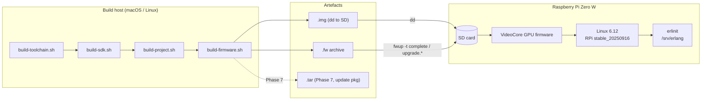
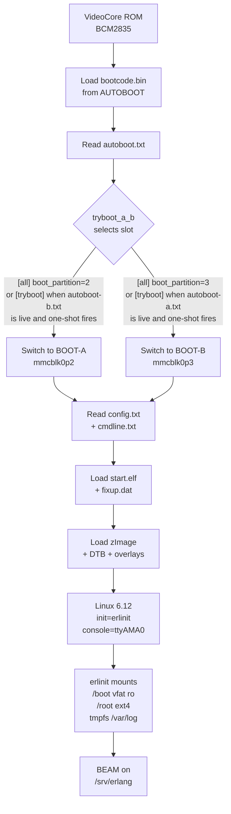
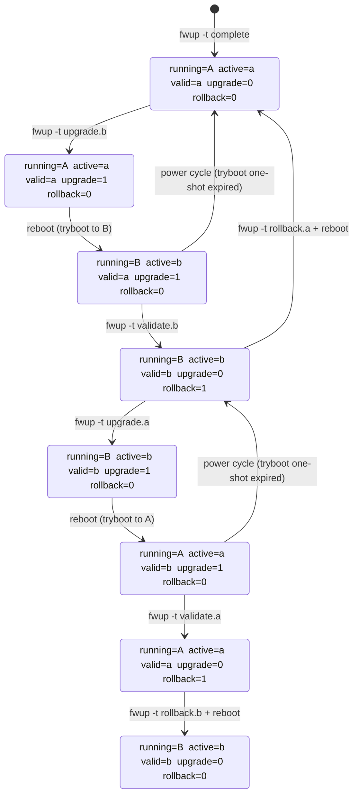
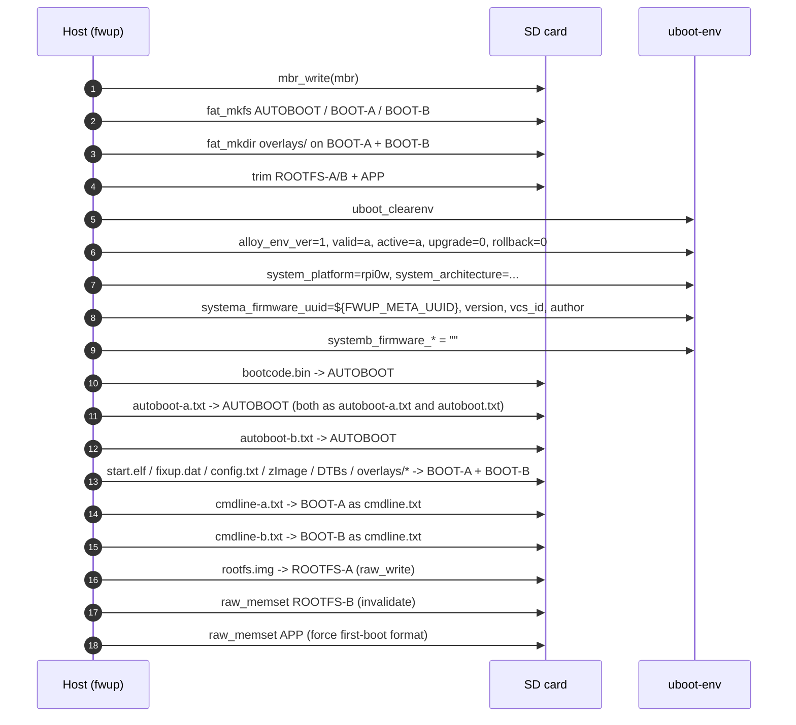
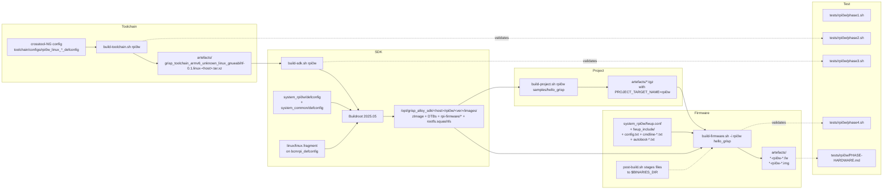
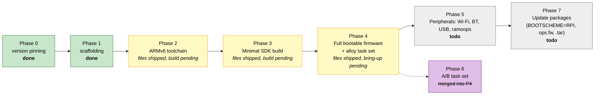

# `system_rpi0w` — Architecture & Design Reference

Design-level documentation for the Raspberry Pi Zero W target. Reflects
the files actually shipping in `system_rpi0w/` + `tests/rpi0w/` today
(Phases 1–4 on disk; Phases 2–4 still need a real build + hardware
bring-up to close out). For the narrower, phase-by-phase implementation
plan see [`../system_rpi0w-plan.md`](../system_rpi0w-plan.md).

- [1. Overview](#1-overview)
- [2. SD card layout](#2-sd-card-layout)
- [3. Boot chain](#3-boot-chain)
- [4. `uboot-env` runtime schema](#4-uboot-env-runtime-schema)
- [5. A/B update lifecycle](#5-ab-update-lifecycle)
  - [5.1 State machine](#51-state-machine)
  - [5.2 Factory flash (`fwup -t complete`)](#52-factory-flash-fwup--t-complete)
  - [5.3 Upgrade + tryboot + validate](#53-upgrade--tryboot--validate)
  - [5.4 Rollback](#54-rollback)
- [6. Build pipeline](#6-build-pipeline)
- [7. File tree](#7-file-tree)
- [8. Phase roadmap](#8-phase-roadmap)
- [9. References](#9-references)

## 1. Overview

`system_rpi0w` is a **hybrid** target: it borrows the RPi Zero W's
bootloader-less boot chain (VideoCore GPU firmware + `tryboot_a_b`)
from `nerves_system_rpi0`, but adopts `grisp_alloy`'s runtime
conventions (same `GRISP_FW_*` defines, same `uboot-env` KV schema,
same `fwup` task vocabulary) verbatim from
`system_kontron-albl-imx8mm/fwup.conf`. The only rpi0w-specific
deviation from the alloy task set is a `fat_write` of `autoboot.txt`
inside `validate.*` / `rollback.*` — the bootloader-less equivalent of
what kontron's U-Boot does at boot time.



## 2. SD card layout

7-partition MBR. AUTOBOOT is primary 0 with `boot=true` so the BCM2835
ROM looks there first; BOOT-A and BOOT-B are FAT siblings; an extended
container holds three logical partitions for rootfs A/B and APP.

```
block offset         size       role                         Linux path
──────────────────────────────────────────────────────────────────────────
0                    1 block    MBR
16                   8 KiB      uboot-env KV store           (raw, no FS)
2048         (1 MiB) 16 MiB     AUTOBOOT FAT (boot=true)     /dev/mmcblk0p1
34816       (17 MiB) 32 MiB     BOOT-A FAT                   /dev/mmcblk0p2
100352      (49 MiB) 32 MiB     BOOT-B FAT                   /dev/mmcblk0p3
165888      (81 MiB) extended   extended container           /dev/mmcblk0p4
  └─ 167936 (82 MiB) 140 MiB    ROOTFS-A squashfs            /dev/mmcblk0p5
  └─ 456704(223 MiB) 140 MiB    ROOTFS-B squashfs            /dev/mmcblk0p6
  └─ 745472(364 MiB) 512 MiB    APP ext4 (expand = true)     /dev/mmcblk0p7
```

Offsets and sizes are sourced from
[`system_rpi0w/fwup_include/fwup-common.conf`](../system_rpi0w/fwup_include/fwup-common.conf)
as a single source of truth; `fwup.conf` and `etc/fw_env.config`
reference the same macros.

**Contents per partition at factory-flash time (`fwup -t complete`):**

| Partition | Contents |
|---|---|
| AUTOBOOT | `bootcode.bin`, `autoboot.txt` (= `autoboot-a.txt`), `autoboot-a.txt`, `autoboot-b.txt` |
| BOOT-A | `start.elf`, `fixup.dat`, `config.txt`, `cmdline.txt` (= `cmdline-a.txt`), `zImage`, `bcm2708-rpi-zero{,-w}.dtb`, `overlays/dwc2.dtbo`, `overlays/miniuart-bt.dtbo` |
| BOOT-B | Same files as BOOT-A, except `cmdline.txt` = `cmdline-b.txt` |
| ROOTFS-A | `rootfs.squashfs` |
| ROOTFS-B | zero-filled (invalidated by `raw_memset`) |
| APP | zero-filled (first boot auto-formats ext4) |

## 3. Boot chain



**Slot selection is entirely driven by `autoboot.txt`** — the live copy
on the AUTOBOOT partition. Whichever slot was validated last is the
sticky `[all]` target; the other slot is the `[tryboot]` one-shot
target. That file is rewritten by `fwup -t validate.{a,b}` and
`fwup -t rollback.{a,b}` (see §5).

## 4. `uboot-env` runtime schema

An 8 KiB raw KV store at block 16. **No U-Boot actually reads this at
boot** — it's userland-only state, queried with `fw_printenv` and
mutated by `fwup` tasks. Adopted verbatim from
`system_kontron-albl-imx8mm/fwup.conf:230-272` so `grisp_updater` and
friends treat rpi0w the same as kontron from userland.

| Variable | Type | Set by | Meaning |
|---|---|---|---|
| `alloy_env_ver` | `"1"` | `complete` | Schema version; all tasks guard on this. |
| `valid_system` | `"a"` / `"b"` | `complete`, `validate.*`, `rollback.*` | The slot known to boot successfully (sticky). |
| `active_system` | `"a"` / `"b"` | `complete`, `upgrade.*` (predictive on-finish) | The slot the device is running. rpi0w-specific: upgrade.* pre-sets this before tryboot-reboot so `status.*.upgraded` tasks match in the validation window. |
| `upgrade_available` | `"0"` / `"1"` | `upgrade.*`, `validate.*`, `rollback.*` | 1 between `upgrade.*` and `validate.*`. |
| `upgrade_fallback` | `"0"` / `"1"` | placeholder (kontron symmetry; rpi0w never sets 1 today) | Reserved for future "revert after N failed boots" logic. |
| `rollback_available` | `"0"` / `"1"` | `validate.*` (sets 1), `rollback.*` (sets 0) | 1 after a successful validation; rollback is one-shot. |
| `bootcount` | int string | `upgrade.*`, `validate.*`, `rollback.*` (all reset to 0) | Placeholder for cross-target schema compat; no bootloader increments it on rpi0w. |
| `system_platform` | `"rpi0w"` | `complete` | Guarded by every task; mismatched `.fw` hits `*.wrongplatform`. |
| `system_architecture` | `"arm-unknown-linux-gnueabihf"` | `complete` | Same. |
| `systema_firmware_{uuid,version,vcs_id,author}` | strings | `complete`, `upgrade.a`, `rollback.b` | Slot A metadata. UUID is filled from `${FWUP_META_UUID}`. |
| `systemb_firmware_*` | strings | `complete` (empty), `upgrade.b`, `rollback.a` | Slot B metadata. |
| `bootargs_extra` | string | `complete` (empty) | Hook for RT isolcpus / ramoops region; currently unused (cmdline-a/b.txt is the authoritative kernel cmdline). |

## 5. A/B update lifecycle

### 5.1 State machine

States are tuples of `(running_slot, active_system, valid_system,
upgrade_available, rollback_available)`. Transition labels are the
`fwup` task that causes them (and a reboot, where applicable).



**Mapping to `status.*` tasks** (read-only diagnostics; `fwup -t
status.<name>` errors out if none match):

| State | Matching `status.*` task |
|---|---|
| `A_validated` | `status.a.validated_no_rollback` |
| `A_validated_rb` | `status.a.validated_with_rollback` |
| `B_validated` | `status.b.validated_no_rollback` |
| `B_validated_rb` | `status.b.validated_with_rollback` |
| `A_upgrading_B` | `status.a.upgrading` |
| `B_upgrading_A` | `status.b.upgrading` |
| `A_pending_val` | `status.a.upgraded` |
| `B_pending_val` | `status.b.upgraded` |
| *(transient, post-rollback, pre-reboot — see §5.4)* | `status.{a,b}.rollback_pending_reboot` |

### 5.2 Factory flash (`fwup -t complete`)

Run once per device, typically against `/dev/mmcblk0` with `fwup -a
-i <fw> -t complete -d <device>` or equivalent via Etcher / `dd`
of the matching `.img`.



**Why both BOOT-A *and* BOOT-B are populated at factory time**: it means
the very first `fwup -t upgrade.b` is a pure rewrite of an already-
formatted FAT, not a format-then-populate. Tryboot-to-B after factory
flash just works.

### 5.3 Upgrade + tryboot + validate

The happy path A → B and back.

```mermaid
sequenceDiagram
    autonumber
    participant user as Operator / grisp_updater
    participant device as Pi Zero W (userland)
    participant fwup as fwup (on device)
    participant gpu as VideoCore firmware
    participant env as uboot-env

    Note over device: Starting state: A_validated<br/>running=A, active=a, valid=a, upgrade=0, rollback=0
    user->>device: ssh + fwup -t upgrade.b new.fw
    device->>fwup: run upgrade.b
    fwup->>env: upgrade_available=0, rollback_available=0
    fwup->>env: systemb_firmware_* = ""
    fwup->>env: trim ROOTFS-B
    fwup->>fwup: fat_write all BOOT-B assets<br/>(incl. cmdline-b.txt as cmdline.txt)
    fwup->>fwup: raw_write rootfs.img -> ROOTFS-B
    fwup->>env: systemb_firmware_{uuid,version,vcs_id,author}<br/>active_system=b, upgrade_available=1, bootcount=0
    fwup->>gpu: reboot_param("0 tryboot")
    Note over device: State: A_upgrading_B
    gpu->>gpu: reset; read autoboot.txt<br/>[tryboot] boot_partition=3 (one-shot)
    gpu->>device: boot BOOT-B -> kernel -> erlinit
    Note over device: State: B_pending_val<br/>running=B, active=b, valid=a, upgrade=1
    device->>fwup: fwup -t validate.b<br/>(erlinit hook or app-driven)
    fwup->>env: valid_system=b, upgrade_available=0, bootcount=0, rollback_available=1
    fwup->>fwup: fat_write AUTOBOOT autoboot.txt<br/>= autoboot-b.txt (sticky)
    Note over device: State: B_validated_rb<br/>running=B, active=b, valid=b, upgrade=0, rollback=1
```

**Failure branch** — if the kernel or userland on the new slot crashes
before `validate.b` runs and the board power-cycles:

- `autoboot.txt` still contains `autoboot-a.txt`'s bytes (validate.b
  never wrote it).
- `[tryboot]` is one-shot and has already been consumed.
- `[all] boot_partition=2` wins → back on A.
- `env` still says `active_system=b, valid_system=a, upgrade_available=1`,
  which no `status.*` task matches cleanly. `fwup -t rollback.a` or a
  subsequent `fwup -t upgrade.b` resets it.

This is the rpi0w analogue of kontron's "bootcount expired, revert to
`valid_system`" — the mechanism differs but the observable outcome is
the same.

### 5.4 Rollback

Explicit operator action. Unlike upgrade, rollback does **not** use
tryboot — it rewrites `autoboot.txt` to point at the other slot via
the `[all]` section directly, so the next normal reboot goes there.

```mermaid
sequenceDiagram
    autonumber
    participant user as Operator
    participant device as Pi Zero W
    participant fwup as fwup
    participant env as uboot-env

    Note over device: Starting state: B_validated_rb<br/>running=B, active=b, valid=b, upgrade=0, rollback=1
    user->>device: ssh + fwup -t rollback.a
    device->>fwup: run rollback.a
    fwup->>env: valid_system=a, rollback_available=0, bootcount=0
    fwup->>env: systemb_firmware_* = ""
    fwup->>fwup: fat_write AUTOBOOT autoboot.txt = autoboot-a.txt
    Note over device: Transient state (status.b.rollback_pending_reboot):<br/>running=B, active=b, valid=a, upgrade=0, rollback=0
    user->>device: reboot (explicit; fwup does NOT reboot itself)
    Note over device: GPU reads autoboot.txt → [all] boot_partition=2 → BOOT-A
    Note over device: State: A_validated<br/>running=A, active=a (stale until next validate/upgrade), valid=a
```

**Known quirk**: post-rollback-reboot, `active_system` in `env` still
reports the pre-rollback slot until the next `upgrade.*` or
`validate.*` runs. `fw_printenv active_system` will lie briefly.
Callers that care should reconcile against `/proc/cmdline` or
`findmnt /`. Setting `active_system` inside `rollback.*` would fix
this, but would also lie during the pre-reboot transient window —
neither choice is correct in all moments without a proper boot hook.
Revisit when we wire up a systemd/erlinit "sync active_system on boot"
unit in Phase 5.

## 6. Build pipeline

Four shell scripts in sequence, each consuming the output of the
previous and emitting exactly one artefact kind.



Script responsibilities:

| Script | Input | Output | rpi0w-specific notes |
|---|---|---|---|
| `build-toolchain.sh` | `toolchain/configs/rpi0w_linux_{x86_64,aarch64}_defconfig` | `grisp_toolchain_armv6_*` tar.xz in `artefacts/` | On non-Linux hosts, self-hoists into Vagrant; no darwin defconfig. |
| `build-sdk.sh` | `system_rpi0w/defconfig` + `system_common/defconfig` + `linux/linux.fragment` | Kernel + DTBs + `rpi-firmware/*` + `rootfs.squashfs` | Sources `crucible.sh` after SDK install for `BOOTSCHEME`, `SQUASHFS_PRIORITIES`, etc. |
| `build-project.sh` | Sample or user project | `.tgz` with release bundle | `PROJECT_TARGET_NAME=rpi0w`. |
| `build-firmware.sh -i` | `.tgz` + `fwup.conf` + staged boot files | `.fw` + `.img` | `post-build.sh` stages `fwup_include/` + `config.txt` + `cmdline-{a,b}.txt` + `autoboot-{a,b}.txt` into `$BINARIES_DIR` so `fwup.conf` host-paths resolve. |
| `build-firmware.sh -u` | Same | `.tar` (Phase 7, needs `BOOTSCHEME=RPI` plugin) | Not yet. |

## 7. File tree

```
system_rpi0w/
├── VERSION                          "0.1.0"
├── Config.in                        (empty target-specific Buildroot opts)
├── external.desc                    informational "name: RPI0W"
├── external.mk                      placeholder for custom packages
├── crucible.sh                      BOOTSCHEME=NONE, FWUP_IMAGE_TARGETS=(complete), OS_RELEASE_PRETTY_NAME
├── defconfig                        Buildroot overrides (ARMv6, RPi kernel, rpi-firmware, Wi-Fi, ...)
├── README.md                        high-level target notes
├── fwup.conf                        full alloy task set (complete + upgrade.* + validate.* + rollback.* + status.*)
├── post-build.sh                    stage fwup_include/ + config.txt + cmdline-*.txt + autoboot-*.txt into $BINARIES_DIR
├── config.txt                       GPU firmware config (gpu_mem, dtoverlay=dwc2, miniuart-bt, ACT LED)
├── cmdline-a.txt                    root=/dev/mmcblk0p5 rootwait rootfstype=squashfs console=serial0,115200 quiet
├── cmdline-b.txt                    root=/dev/mmcblk0p6 (same)
├── autoboot-a.txt                   [all] boot_partition=2  [tryboot] boot_partition=3
├── autoboot-b.txt                   [all] boot_partition=3  [tryboot] boot_partition=2
├── fwup_include/
│   ├── fwup-common.conf             partition offsets/counts + uboot-env block
│   └── provisioning.conf            empty include stub
├── linux/
│   └── linux.fragment               kernel config overlay on bcmrpi_defconfig
│                                    (squashfs/ext4 builtin + PSTORE_RAM)
└── rootfs_overlay/
    └── etc/
        ├── erlinit.config           -c ttyAMA0, -m /dev/mmcblk0p2:/boot:vfat:ro..., -m tmpfs, -r /srv/erlang, -n rpi0w-%s
        └── fw_env.config            /dev/mmcblk0 0x2000 0x2000 0x200 16

toolchain/configs/
├── rpi0w_linux_x86_64_defconfig     crosstool-NG: ARMv6 / arm1176jzf-s / VFP / GCC 13
└── rpi0w_linux_aarch64_defconfig    same target, aarch64 build host

tests/rpi0w/
├── _lib.sh                          phase test helpers (phase / pass / fail / summary)
├── phase1.sh                        offline scaffold check
├── phase2.sh                        toolchain artefact + cross-compile hello.c + readelf asserts
├── phase3.sh                        /opt/grisp_alloy_sdk/*/rpi0w/*/images/ contents
├── phase4.sh                        .fw meta + resource list + full task set
├── PHASE-HARDWARE.md                manual hardware bring-up checklist (Phase 4+)
└── README.md                        test runner intro
```

## 8. Phase roadmap



### What "files shipped, build pending" means

The repository contains every source file the build scripts require for
that phase; the remaining work is to actually run the scripts on a
capable host and iterate on any fixups the compiler / Buildroot /
fwup surfaces. Validation for each phase is scripted:

```bash
./tests/rpi0w/phase1.sh                 # Phase 1 (offline)
./build-toolchain.sh rpi0w && ./tests/rpi0w/phase2.sh
./build-sdk.sh      rpi0w && ./tests/rpi0w/phase3.sh
./build-project.sh  rpi0w samples/hello_grisp
./build-firmware.sh -i rpi0w hello_grisp && ./tests/rpi0w/phase4.sh
# then: tests/rpi0w/PHASE-HARDWARE.md (manual)
```

## 9. References

**Internal:**

- [`../system_rpi0w-plan.md`](../system_rpi0w-plan.md) — the phase-by-phase implementation plan (single source of truth for decisions).
- [`../system_rpi0w/fwup.conf`](../system_rpi0w/fwup.conf) — authoritative definition of the task set.
- [`../system_rpi0w/fwup_include/fwup-common.conf`](../system_rpi0w/fwup_include/fwup-common.conf) — authoritative partition layout.
- [`../system_kontron-albl-imx8mm/fwup.conf`](../system_kontron-albl-imx8mm/fwup.conf) — the template that drove the `uboot-env` schema and task vocabulary adopted here.
- [`../system_grisp2/fwup.conf`](../system_grisp2/fwup.conf) — reference for `GRISP_FW_*` defines + MBR partitioning conventions.
- [`../tests/rpi0w/PHASE-HARDWARE.md`](../tests/rpi0w/PHASE-HARDWARE.md) — manual hardware checklist for Phase 4+.

**External:**

- [Raspberry Pi tryboot documentation](https://www.raspberrypi.com/documentation/computers/config_txt.html#tryboot) — `tryboot_a_b`, `autoboot.txt`, one-shot semantics.
- [fwup config reference](https://github.com/fwup-home/fwup/blob/main/docs/configuration.md) — `mbr`, `uboot-environment`, `on-resource`, `fat_write`, `raw_write`, `reboot_param`.
- [Buildroot manual — external trees](https://buildroot.org/downloads/manual/manual.html#outside-br-custom) — how `BR2_EXTERNAL` resolves `system_common` + `system_<target>`.
